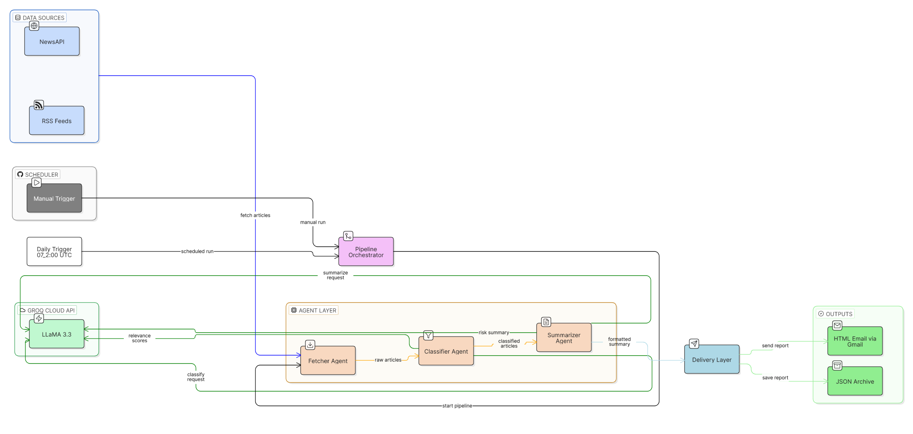

<div align="center">

# 🧠 Agentic Risk Summarizer

### Multi-agent insurance risk intelligence pipeline with daily email delivery

[](https://www.python.org/)
[](https://groq.com/)
[](https://newsapi.org/)
[](https://en.wikipedia.org/wiki/RSS)
[](https://github.com/features/actions)

Automates daily collection, classification, summarization, and delivery of insurance-relevant risk signals at **07:00 UTC**.

[Quick Start](#-quick-start) • [How It Works](#-how-it-works) • [Automation](#-automation) • [Project Structure](#-project-structure)

</div>

---

## ✨ What it does

| Stage | Description |
| --- | --- |
| **Fetch** | Pulls fresh signals from NewsAPI and configured RSS feeds |
| **Classify** | Labels and prioritizes risk-relevant items with Groq LLaMA 3.3 |
| **Summarize** | Produces structured daily risk summaries with clear action context |
| **Deliver** | Sends a polished HTML report by email and stores JSON archive |

---

## 🧩 How it works

1. **Fetcher Agent** gathers candidate stories and filters duplicates.
2. **Classifier Agent** scores items by relevance/severity.
3. **Summarizer Agent** generates digestible risk intelligence output.
4. **Delivery Layer** renders HTML and sends via Gmail SMTP.

## 🏗 Architecture


---

## 🚀 Quick Start

### 1) Setup

```bash
git clone <repo_url>
cd Agentic-Risk-Summarizer
python -m venv .venv
```

Activate env:

- **Windows (PowerShell):**
  ```powershell
  .venv\Scripts\Activate.ps1
  ```
- **macOS/Linux:**
  ```bash
  source .venv/bin/activate
  ```

Install dependencies:

```bash
pip install -r requirements.txt
```

### 2) Configure `.env`

Copy `.env.example` to `.env` and set:

- `GROQ_API_KEY`
- `NEWS_API_KEY`
- `GMAIL_USER`
- `GMAIL_APP_PASSWORD`
- `RECIPIENT_EMAIL` (optional; defaults to sender)

### 3) Run locally

```bash
python pipeline.py
```

Outputs:
- `reports/YYYY-MM-DD.json`
- HTML email sent via Gmail SMTP

---

## 🤖 Automation

Workflow: `.github/workflows/daily_pipeline.yml`

Triggers:
- **Daily** at `07:00 UTC`
- **Manual** via `workflow_dispatch`

Required repo secrets:
- `GROQ_API_KEY`
- `NEWS_API_KEY`
- `GMAIL_USER`
- `GMAIL_APP_PASSWORD`

---

## ✅ Testing

```bash
python -m unittest discover -s tests -v
```

---

## 📁 Project Structure

```text
Agentic-Risk-Summarizer/
├── config.py
├── schemas.py
├── pipeline.py
├── delivery.py
├── report_template.html
├── agents/
│   ├── fetcher.py
│   ├── classifier.py
│   └── summarizer.py
├── data/
│   ├── rss_feeds.json
│   └── processed_urls.json
├── reports/
├── tests/
│   ├── test_fetcher.py
│   ├── test_classifier.py
│   └── test_schemas.py
├── .github/workflows/daily_pipeline.yml
└── requirements.txt
```

